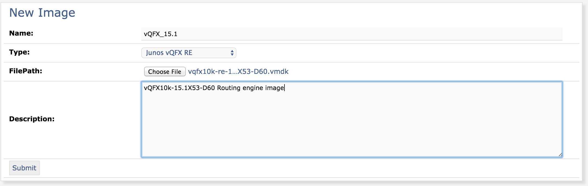
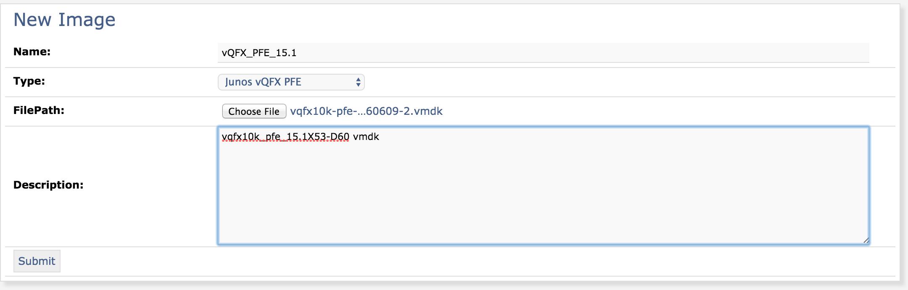
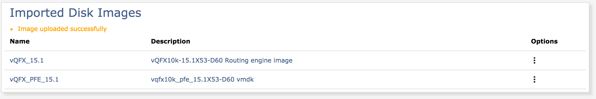
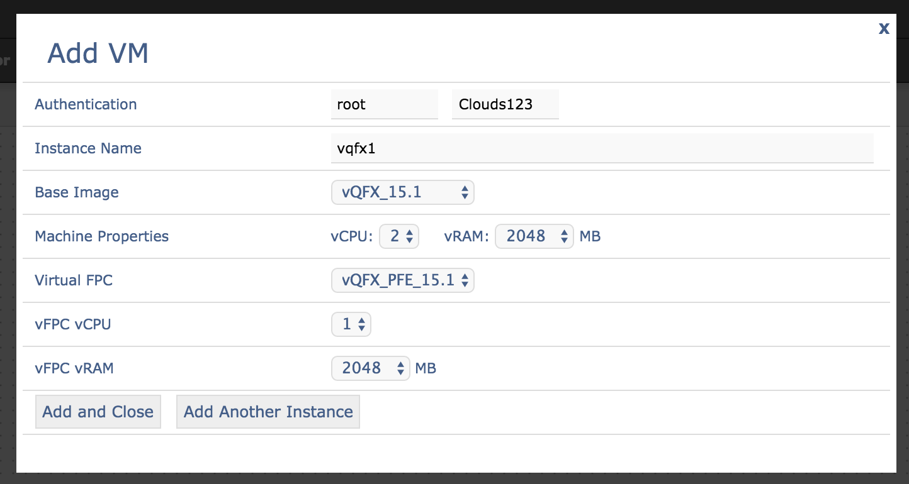
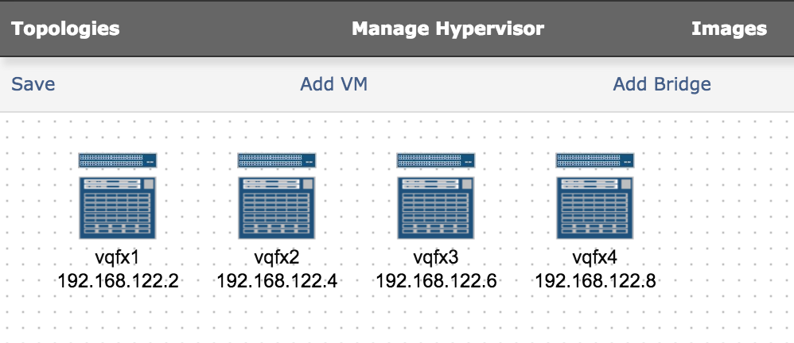
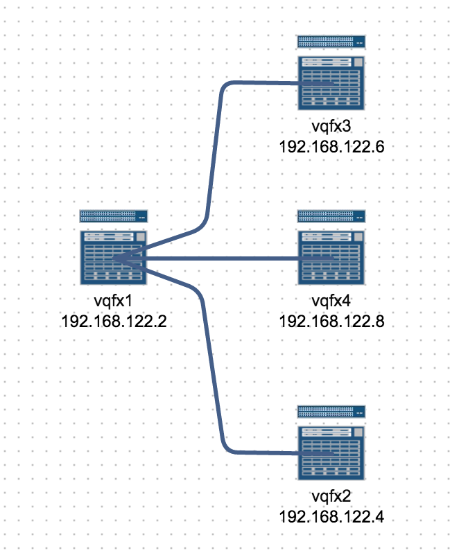
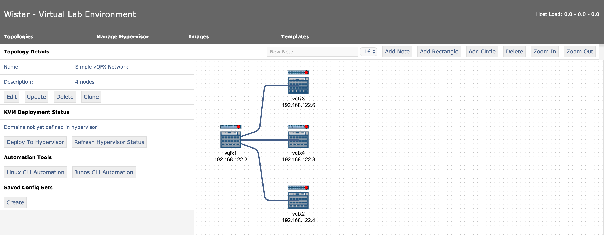
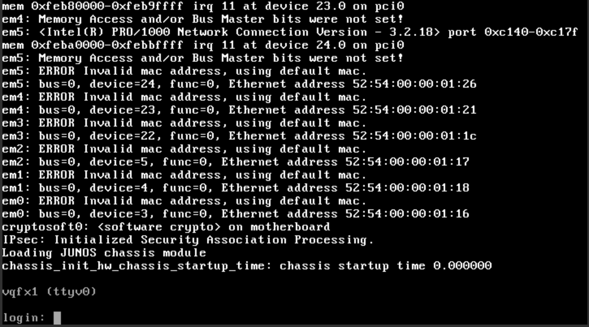
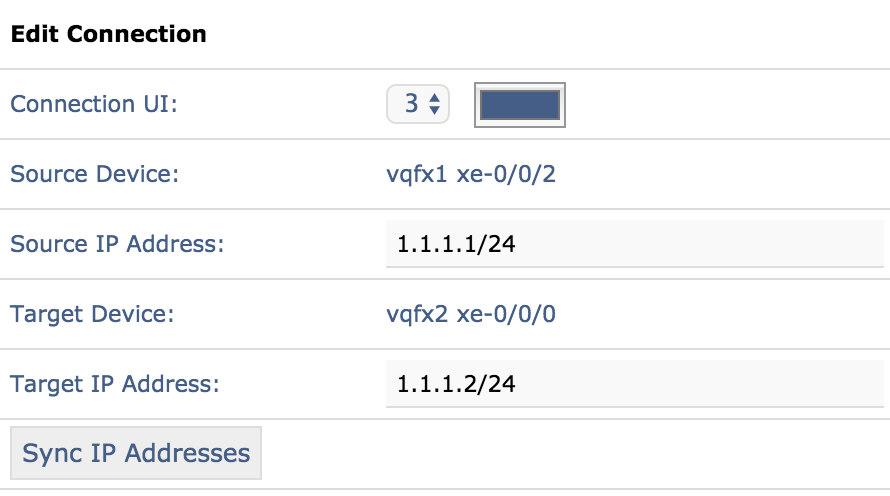
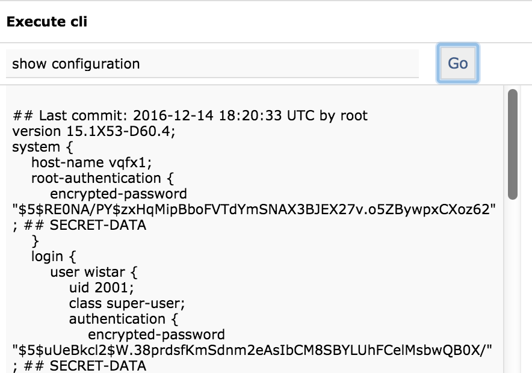

Getting Started with Wistar
===========================

.. _here: https://github.com/Juniper/wistar/blob/master/README.md
.. _vQFX: http://www.juniper.net/us/en/dm/free-vqfx-trial/
.. _project: https://github.com/nembery/wistar_packer

Before you begin, you'll need to install Wistar. Instructions for doing this on an Ubuntu system or VM can be
found here_. An automated installation using Packer can be found in this project_.

Supported Virtual Machine image types
-------------------------------------

Once you have a Wistar instance up and running, you'll need to upload a couple of images. Wistar has full support
for the following:

- Ubuntu 16.04 cloudimg
- Ubuntu 14.04 cloudimg
- Generic Linux (cloud-init enabled)
- Juniper vMX 15.1 (16.1+ not yet supported)
- Juniper vSRX 15.1
- Juniper vQFX 15.1
- Juniper vRR
- Juniper Junos Space

Any other virtual machine can be used with the 'Other' type. Wistar supports the following image formats:

 - qcow2
 - vmdk

Customizing the environment
---------------------------

You will also want to customize your environment as well. Edit the wistar/configuration.py file to include
your username, SSH key, and default instance password. All cloud-init or config-drive enabled images will have
these automatically configured on boot up.

Uploading images
----------------

For this example, we'll use the Juniper vQFX. To obtain the latest, visit the vQFX_ free trial page. Download both
the vQFX10K RE and QFX10K PFE disk images. Select the vmdk formatted images.

Navigate to the wistar application in a modern browser. Google Chrome is used for testing and validation and is
known to work without issues.

First, let's upload our images. Hover over the 'Images' toolbar item and select 'Upload Image'.

Fill out the 'Upload image' form with an image name, image description, and an image type. For the vQFX RE, select
the image type of "Junos vQFX RE". Select the vqfx10k-re-15.1X53-D60.vmdk image.

.. NOTE::
  Make sure you select the proper 'Image Type' for each image you upload!

Once successful, upload the vQFX PFE image in the same manner. Use the 'Junos vQFX PFE' image type. Also, you must
ensure the name you choose for the pfe image includes the 'pfe' string so Wistar will correctly populate the vpfe
list for the vqfx-re image.

Building a topology
-------------------

Now, we can build a network topology of multiple vQFXs.

Navigate to the 'Topologies' menu item and click on 'New Topology'. From this screen we can add all the relevant
objects to the canvas.

Click on 'Add VM'. Fill out this form with an Instance Name, authentication information,
desired amount of vCPU and vRAM. If an image requires another image as a PFE or companion image, the relevant
fields will be shown. Wistar will set the correct, recommended values where possible. For the vQFX, fill out the
'Add VM' form with the following information:

Click on 'Add Another Instance'. This will add the instance to the canvas and allow you to add another one in quick
succession. For this example, I added 4 vQFX to the topology.

Click on the 'x' to close this window and return to the canvas. Now we have 4 vQFX ready to be wired together to form
our networks. Drag and drop the icons to the desired locations. Next, click on the 'port' icons in the center of an icon
and drag it to the port icon of another icon to create a link. This will connect the first interface of that VM to the
first interface of the next VM. Additional connections will wire the second or third interface and so on.

Once the connections have been built and the various icons and connections have been arranged properly, click on the
'Save' menu item to save this topology. Fill out the save topology form with a name and description and click save.

Deploying a topology and starting instances
-------------------------------------------

This will then show the Topology Details screen. From here, we can deploy our topology to the configured deployment
backend. By default this will deploy to KVM.

Click on 'Deploy to Hypervisor'. This will create all the virtual machines and bridges necessary for our desired
topology.

.. image:: screenshots/deployment_status.png

Click on the red status icon to start each VM. This may take several minutes depending on your environment.

.. NOTE::
  Starting too many VMs at once can really bog down your machine!

Accessing an instance console
-----------------------------

A green status indicator in the upper right hand corner of an icon means there is a console available. You can
 double-click on an icon to view it's VNC console in a new tab.

.. NOTE::
   You will need to ensure this site is allowed to open new windows in your browser!

Double click on any icon that has a green status indicator to open the console.

You can see here that vqfx1 is already booted and is ready for configuration! You'll note here that the hostname has
already been set via config-drive. Wistar will generate a default configuration that consists of the hostname,
management ip information, default routes, user names and SSH keys as appropriate. This may be customized via the
common/templates/junos_config.j2 jinja2 template.

Automation Examples
-------------------

Wistar uses NETCONF to automate as many common tasks as possible. For example, clicking on a connection between two
instances will show the 'Edit Connection' dialog. From here, you may enter a source and destination IP addresses and
click the 'Sync IP Addresses' button. This will push the IP information to both instances automatically.

Another example of useful automation is clicking on an instance reveals the 'Execute CLI' dialog will appear.
This allows sending simple CLI commands to the instance again via NETCONF. If the image inherits from a Linux image,
the CLI command will be executed via SSH instead.

There are many other options and features built in to Wistar. More documentation will be coming soon!

