Installing Junos Space 17.1R1 on Wistar
=======================================

.. _instructions: https://github.com/Juniper/wistar/blob/master/README.md
.. _website: https://www.juniper.net/support/downloads/?p=space#sw
.. _KB26220: https://kb.juniper.net/InfoCenter/index?page=content&id=KB26220
.. _`Junos Space 17.1 Documentation`: https://www.juniper.net/documentation/en_US/junos-space17.1/topics/task/configuration/junos-space-virtual-appliance-configuring.html

This guide assumes you have a working Wistar installation.  If you have not installed Wistar yet, please see the installation instructions_ for both Ubuntu and VM based installs.

Requirements
------------

The following are the hardware requirements for Junos Space in addition to that required by the Wistar installation.

- **vCPU:** 4
- **vRAM:** 16834MB

Uploading the Image
-------------------

1. Download the 17.1R1 .qcow2 KVM Appliance Image from the Juniper Networks website_.  You will need a valid username and password to do so.
2. Once the image is downloaded, navigate to your Wistar page to upload the image.
3. Mouseover **Images** and click the **Upload Image** link.

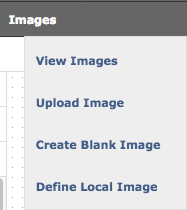

4. In the **Name:** field, name the image.
5. Click the **Type:** dropdown and select **Junos Space**.
6. Click the **Browse...** button next to **FilePath:** and select the downloaded .qcow2 image file location your local machine.
7. In the **Description:** field, enter a description for the image.
8. Click on the **Submit Query** button to upload.  Please note that there is not be a progress bar, so just be patient as the image is a large file and may take some time to upload.

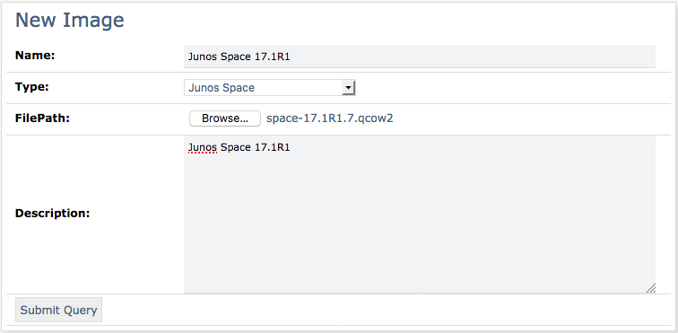

Building a Topology with Junos Space
------------------------------------

In this example, we'll build a topology with Junos Space and discover 3 vMX devices.

1. Mouseover **Topologies** and click the **Create Topology** link.
2. Click the **Add VM** link.
3. Fill in all of the necessary fields in the form, be sure to select your Junos Space image in the **Base Image** dropdown menu. *NOTE:* **Thick Provision and resize with:** may be left at 0.
4. Click **Add and Close** to finish, or **Add Another Instance** to add more instances.

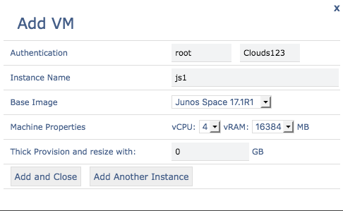

Junos Space requires one external bridge and two internal bridges in order to fully operate with our topology.  

5. Add them by clicking on the **Add Bridge** link for each required bridge.  **Be sure that you drag the connections in the following order, connections are enumerated as you drag them (eth0 first, eth1 second, etc.)**
6. **External Bridge (eth0):** br0
7. **Private Bridge 1 (eth1):** Private 1
8. **Private Bridge 2 (eth2):** Private 2
9. **eth3** will be created by automatically and attach to the **vibr0** management bridge in Wistar.

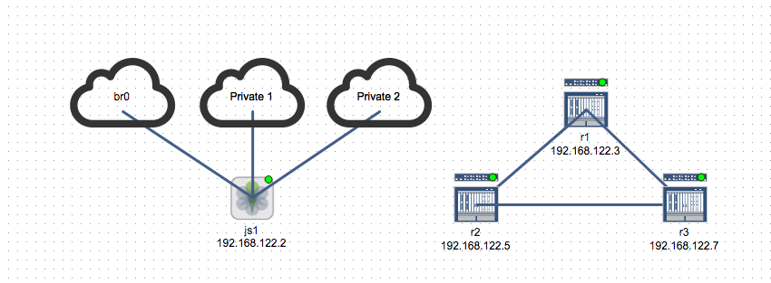

10. Once all of the desired instances, bridges, and connections are created, under the **KVM Deployment Status** table, click **Deploy To Hypervisor**.
11. When the topology is deployed, click **Start Topology**.  A window will appear asking you to confirm, click **OK**.

Setting up Junos Space
----------------------

Next, we'll have to make some changes under the hood to get things working.

1. Under the **KVM Deployment Status** table, next to your Junos Space instance, click the icon that looks like a small computer monitor, this let's you access the out of band console for the Junos Space server.

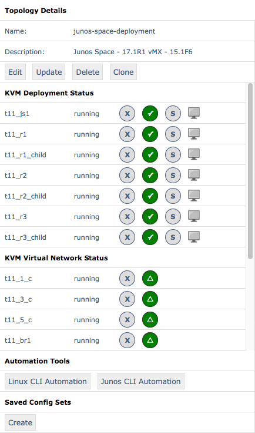

2. Log in with the default username/password - **admin/abc123**
3. You will be prompted to change the **admin** password immediately, set it accordingly.
4. Select **"S"**.  The prompts to setup the Junos Space node will now appear.

::

  This Junos Space node can be installed as one of the following:

    (S)pace Platform
      Full functionality.  Every Junos Space installation requires at least one Space node.

    (F)MPM
      Specialized to fault and performance monitoring only.
      This requires at least one Space node.

  Choose the type of node to be installed [S/F] S

5. Select **1** to configure IPv4 attributes.  When prompted to enter a new IPv4 address, ensure the address belongs to your external LAN that your laptop uses to connect to the Wistar server.  The network in this example is 10.1.0.0/24 with my gateway set as 10.1.0.1.

::

  Configuring Eth0 :

  1> Configure IPv4
  2> Configure Both IPv4 and IPv6

  R> Redraw Menu

  Choice [1-2,R]:

  Please enter new IPv4 address for interface eth0
  10.1.0.205
  
  Please enter new IPv4 subnet mask for interface eth0
  255.255.255.0

  Enter the default IPv4 gateway as a dotted-decimal IP address:
  10.1.0.1

  Please type the IPv4 nameserver address in dotted decimal notation:
  8.8.8.8

6. When asked to configure a separate interface for device management, enter **y**, and select **1** to configure IPv4.  You will use the IP address, mask, and gateway that Wistar already defined in the topology map for Junos Space in the 192.168.122.0/24 network.

::

  Configure a separate interface for device management? [y/N]

  > Configuring eth3:

  1> Configure IPv4
  2> Configure IPv6
  3> Configure Both IPv4 and IPv6

  R> Redraw Menu

  Choice [1-3,R]: 1

  Configuring IPv4 for interface eth3

  Please enter new IPv4 address for interface eth3
  192.168.122.2
  Please enter new IPv4 subnet mask for interface eth3
  255.255.255.0
  Enter the default IPv4 gateway for this interface:
  192.168.122.1

7. When prompted if Junos Space is going to be added to an existing cluster, enter **N**.

::

  Will this Junos Space system be added to an existing cluster? [y/N] 

8. You will then be prompted to configure the web GUI IP address, select **1** to configure IPv4 and use an address in your local LAN that is **different** from the previously configured management IP.

::

  Configuring IP address for web GUI:

  1> Configure IPv4

  R> Redraw Menu

  Choice [1,R]: 1

  Please enter IPv4 address for web GUI:
  10.1.0.210

9. NAT and NTP configuration is optional and can be skipped by selecting **N**.

::

  Do you want to enable NAT service? [y/N] 

  Add NTP Server? [y/N] 

10. Configure your display name for the system (this does not have to match your instance name in the topology).

::

  Please enter display name for this node: js1

  Enter password for cluster maintenance mode:
  Re-enter password:

11. You will now have the opportunity to verify your settings, once you are satisfied with them enter **A** to apply the settings.  Junos Space will then reboot to complete the installation.

::

  Settings Summary:

  > IPv4 Change: eth0 is 10.1.0.205 / 255.255.255.0
  > Default IPv4 Gateway = 10.1.0.1 on eth0
  > IPv4 DNS add: 8.8.8.8
  > IPv4 Change: eth3 is 192.168.122.2 / 255.255.255.0
  > eth3 IPv4 Gateway: 192.168.122.1
  > Create as first node or standalone
  > Web IPv4 address is 10.1.0.210
  > Node display name is "js1"
  > Password for Junos Space maintenance mode is set.

  A> Apply settings
  C> Change settings
  Q> Quit and set up later
  R> Redraw Menu

  Choice [ACQR]: 

12. Once Junos Space comes back, we can make some performance enhancements by dropping into the root shell, this is accomplished by entering **7**.

:: 

  1> Change Password
  2> Change Network Settings
  3> Change Time Options
  4> Retrieve Logs
  5> Security
  6> Expand VM Drive Size
  7> (Debug) run shell

  A> Apply Changes
  Q> Quit
  R> Redraw Menu

  Choice [1-7,AQR]:

13. Disable the jmp-opennms service.

::

  [sudo] password for admin:
  [root@space-525400000b1f ~]# service jmp-opennms stop
  Manually stop opennms...
  opennms is running..
  Stopping OpenNMS...
  Stopping OpenNMS: [  OK  ]
  [root@space-525400000b1f ~]#
  [root@space-525400000b1f ~]# chkconfig --level 345 jmp-opennms off
  [root@space-525400000b1f ~]# service jmp-opennms stop
  Manually stop opennms...
  opennms is running..
  Stopping OpenNMS...
  Stopping OpenNMS: [  OK  ]

14. Further enhancements can be made by truncating tables in MySQL.

::

  [root@space-525400000b1f ~]# mysql -pnetscreen -ujboss -Dbuild_db

  mysql> truncate table SchemaEntity;
  Query OK, 0 rows affected (0.03 sec)

  mysql> SET FOREIGN_KEY_CHECKS = 0;
  Query OK, 0 rows affected (0.04 sec)

  mysql> truncate table DmiSchemaEntity;
  Query OK, 0 rows affected (0.03 sec)

15. Now we need adjust Junos Space's built-in KVM hypervisor, as it will conflict with our default network that Wistar is using (192.168.122.0/24), we accomplish this by editing the references to 192.168.122.0/24 in the */usr/share/libvirt/networks/default.xml* file.  Use your favorite text editor to accomplish this, my example uses 192.168.126.0/24.

::

  [root@space-525400000b1f ~]# cat /usr/share/libvirt/networks/default.xml
  <network>
    <name>default</name>
    <bridge name="vibr0" />
    <forward />
    <ip address="192.168.126.1" netmask="255.255.255.0">
      <dhcp>
        <range start="192.168.126.2" end="192.168.126.254" />
      </dhcp>
    </ip>
  </network>

At this point we should be able to access Junos Space via the web browser by using the IP address we set as the IPv4 web GUI address.  In this example the address that was used is 10.1.0.210.

16. Log in using the default web credentials **super/juniper123**.  You will immediately be prompted to change the password, do so.
17. You will need to log back in using the newly set password.

.. ::image screenshots/space/web_gui_login_junos_space.png

Discovering Devices
-------------------

As a final test to ensure Junos Space is working correctly, let's discover our 3 vMX routers.

1. It is required that basic SNMP access has been configured on the routers, if that has not been done, please do so now.  Below is a generic example for SNMPv1/v2 access.

::

  snmp {
      community wistar {
          clients {
              192.168.122.0/24;
          }
      }
  }

2. Log into Junos Space.
3. Expand the **Devices** section by clicking the **+**.
4. Under **Devices**, expand the **Device Discovery** section by clicking the **+**, then click **Device Discovery Profiles**.

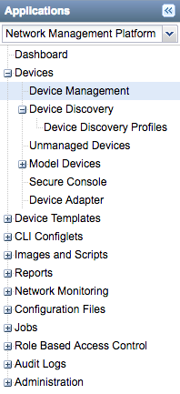

5. In the main pane, click the green **+** to start the creation of a new discovery profile.

6. Name your profile, and designate the method of discovery.  In this example we are using the **Subnet** method since we know that our Wistar subnet (192.168.122.0/24) will make things easy.
7. As you complete this section, click the **Next** button to continue.

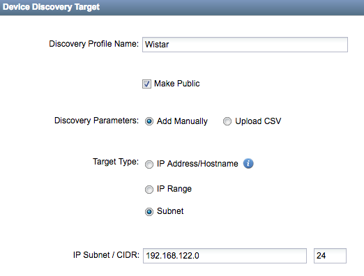

8. Configure the type(s) of discovery probes you wish to use, in our example we're setting up basic SNMPv1/v2 access.  Be sure to adjust your SNMP Community string to match your devices if required.  Click the **Next** button to continue.

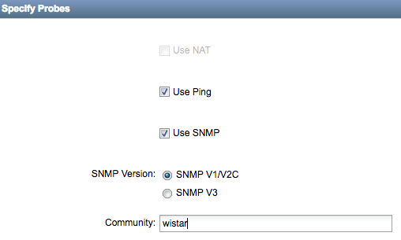

9. Setup your credential or key based authentication, in this example we're using credential based.  

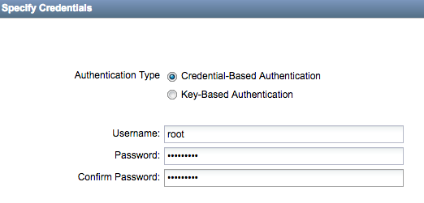

10. Skip the **Specify Device FingerPrint** section by clicking the **Next** button.
11. Configure your discovery schedule, we'll use a generic example that will rediscovery devices daily.  Click the **Next** button when this has been completed.

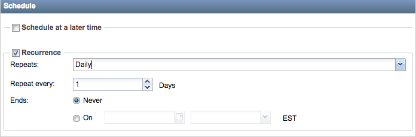

12. Now click the **Discover** button, Junos Space will begin discovery and show you progress as it moves through the discovery process.  
13. When the job is complete, you can view your newly discovered devices in the **Devices** => **Device Management** tab.

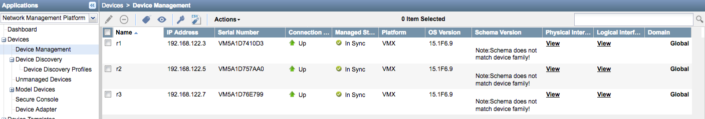

References
----------

1. KB26220_ - *Overview of the Junos Space default user IDs and passwords AND changing the Admin password*
2. `Junos Space 17.1 Documentation`_ - *Configuring a Junos Space Virtual Appliance as a Junos Space Node*

Special thanks to Nathan Embery and Tim Brown!
