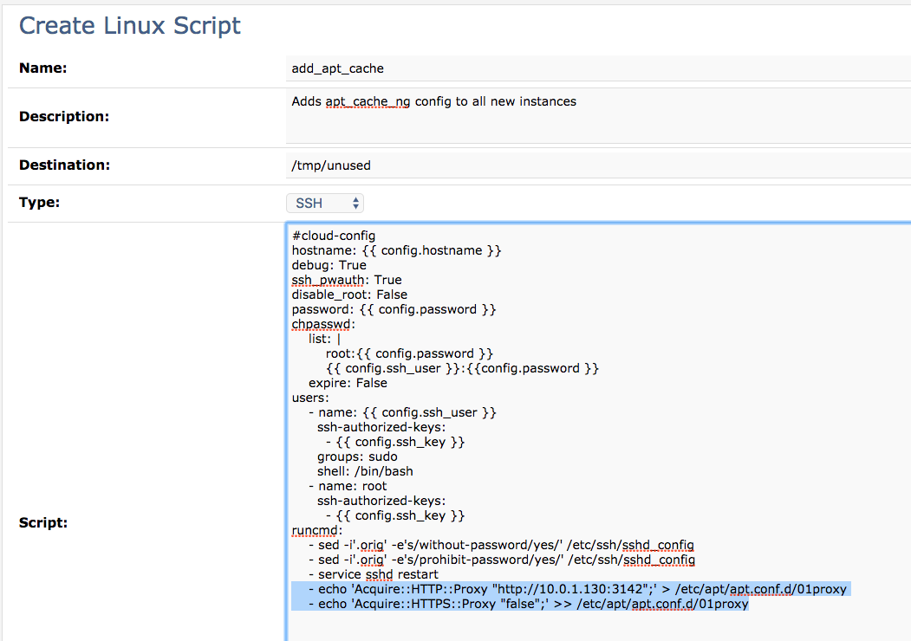
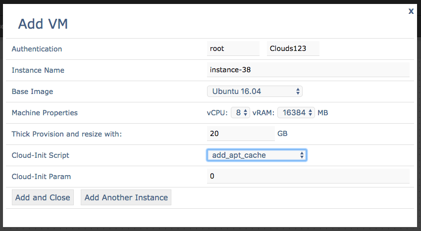
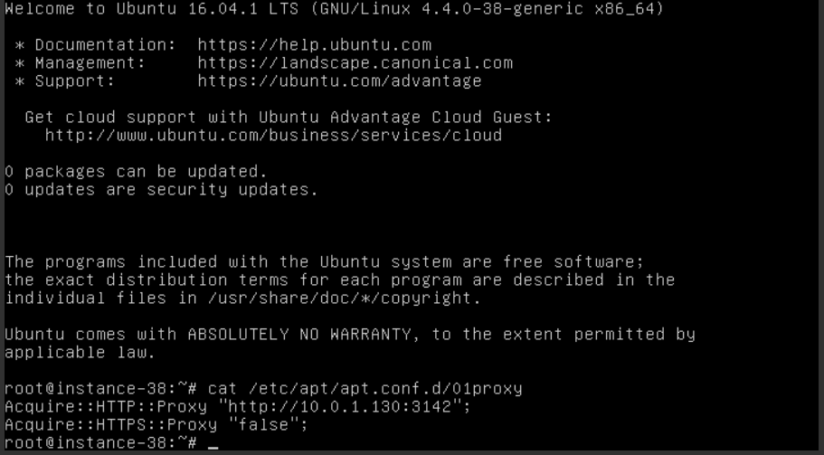

Tips and Tricks
===============

.. _docs: https://cloudinit.readthedocs.io/en/latest/

SSH Key based authentication
----------------------------

Wistar will configure SSH key based authentication by default on all images that use it. For this to be useful in your
environment, you need to edit the 'ssh_user' and 'ssh_key' parameters in the wistar/configuration.py file. The 'ssh_user'
should match the user that will log into each instance. The 'ssh_key' should be the contents of your public SSH key.
This can usually be found in ~/.ssh/id_rsa.pub

Custom Cloud Init Scripts
-------------------------

Wistar has native support for cloud-init (docs_) for images that support it. By default, Wistar
will create an ISO image that contains both a meta-data and user-data file. The user-data file is
created from a default template that set's up things like SSH key based authentication, allows root login,
and set the hostname.

Wistar also allows the user to specify a custom cloud init script to be used as well. To do this, first
create a new 'Linux Script' under the 'Templates' section.

In this case, I've added a couple of commands to add a custom apt proxy configuration to apt. This points each
instance to my local apt_cache_ng instance. This is useful to cache apt packages from many instances when installing
lots of different software packages for example.

Once you save your script, it will be available when creating a new instance in the 'New Topology' screen.

Once the instance boots up, we should see the script was executed.

Ansible Integration
-------------------

Wistar includes a dynamic inventory script for Ansible in the 'extras' directory. To use the dynamic inventory, export
a topology to your Ansible project directory.

There is also a 'load_topology_pb.yml' playbook that can be used to take
someone else's topology and load it into your current environment and output an updated topology file for use with the
dynamic inventory. For this to work, you need to import all the referenced image types into your wistar instance.
I.E. if the topology to be loaded contains ubuntu16, vmx, and vqfx images, you will need to load all of those into your
wistar instance before you can import this topology.

Finally, there is also an 'install_wistar_ubuntu_16_pb.yml' playbook that can be used to install Wistar on Ubuntu 16.