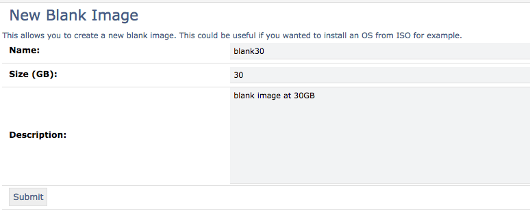
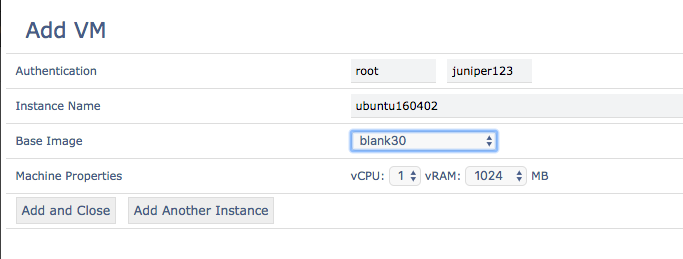
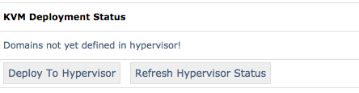
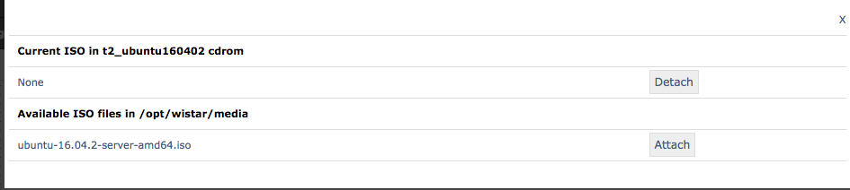
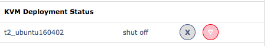
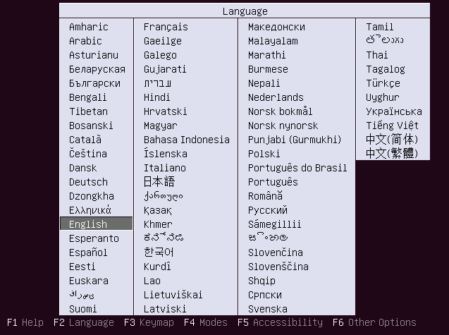

Working with ISO images
=======================

Often times it is desirable to build a new image from an ISO image. Wistar helps automate this process.

Uploading an ISO image to wistar
--------------------------------

First, use scp to copy your desired ISO image to the wistar server and placed in the `/opt/wistar/media` directory.

::

    scp ubuntu-16.04.2-server-amd64.iso root@10.10.10.10:/opt/wistar/media

Next, we need to define a new 'blank' image type. This will allow wistar to create a VM with a freshly formatted, blank,
hard disk.

.. image:: screenshots/manage_iso/define_blank_image_01.png

On the 'New Blank image' screen, enter the desired size in GB for the new disk image. In this case, we will create
a new image with 30GB of space.

We can now build a new topology with the blank image. We need to do this so we can deploy the image to an actual VM
where we can attach the ISO and perform the installation. Create a new topology and add a new instance using the newly
created blank image as our 'Base Image'. In this case, I've named this instance 'ubuntu160402'.

Save the topology and deploy as normal

Once deployed, we can attach the ISO. It's important to do this *before* you start the instance as we want to instance
to boot from the ISO.

To attach the ISO, click on the instance icon on the topology. Pro-tip: be sure to avoid clicking on the link connector
in the center of the icon! Clicking around the edges works best here!

.. image:: screenshots/manage_iso/instance_details.png

In the left menu area, you should see the instance details appear. There is an action button labeled 'Manage Attached
 ISO'. Clicking on this button will show a new pop-over window with a list of all ISO files found in the
`/opt/wistar/media` directory.

This window allows you to attach or detach the specified ISO file on the virtual machine instance. Technically, this
inserts the correct XML configuration in the libvirt domain XML configuration file to instruct the hypervisor to use this
ISO file as the 'cdrom' drive on the VM. Perfect for OS installations!

Once the ISO is attached, you can go ahead and boot up the instance using the deployment status menu.

Opening the console using the 'View Console' icon will now show the VM has booted from the ISO.

After installation, you can perform a Block pull and clone operation to create a new, reusable image for other topologies
as well.

